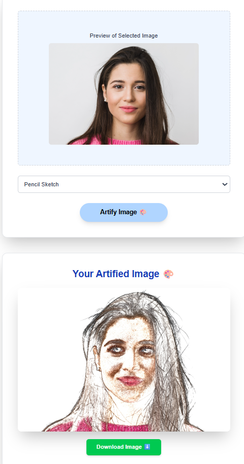

# VisiArt – AI-Powered Artistic Image Stylization

VisiArt is a full-stack web application that transforms user-uploaded images into various artistic styles using a combination of deep learning and traditional image processing techniques. It uses a FastAPI backend with a PyTorch-based model and a responsive Next.js frontend to provide real-time, stylized image generation.

---

## Features

- AI-powered facial cartoonization using a white-box model (CVPR 2020)
- Style options include:
  - Cartoon (deep learning)
  - Pencil Sketch
  - Oil Painting
  - Stylized
  - Sepia
  - Black & White
- Live preview of the selected image
- Downloadable styled output
- Responsive and modern frontend UI (Next.js + TailwindCSS)
- FastAPI backend using PyTorch and OpenCV

---

## Technologies Used

| Frontend     | Backend     | Image Processing / ML |
|--------------|-------------|------------------------|
| Next.js (TypeScript) | FastAPI     | PyTorch                |
| React        | Uvicorn     | OpenCV                 |
| TailwindCSS  | CORS        | Pretrained Cartoonization Model |

---

## Screenshot

Below is an example of the app in action using the "Pencil Sketch" style:



## Getting Started

### 1. Clone the Repository

```bash
git clone https://github.com/Yat-98/visiart.git
cd visiart
```

### 2. Backend Setup

```bash
cd backend
python -m venv venv
venv\Scripts\activate   # On Windows
pip install -r requirements.txt
uvicorn inference:app --reload
```

### 3. Frontend Setup

```bash
cd ../frontend
npm install
npm run dev
```

Visit: http://localhost:3000

## Folder Structure

```plaintext
visiart/
├── backend/               # FastAPI backend with model + inference
│   ├── inference.py       # API endpoint and model logic
│   └── weight.pth         # Pretrained model (not committed)
├── frontend/              # Next.js frontend with React UI
│   └── public/            # Static assets (e.g. logo, screenshot)
└── README.md              # Project documentation
```
